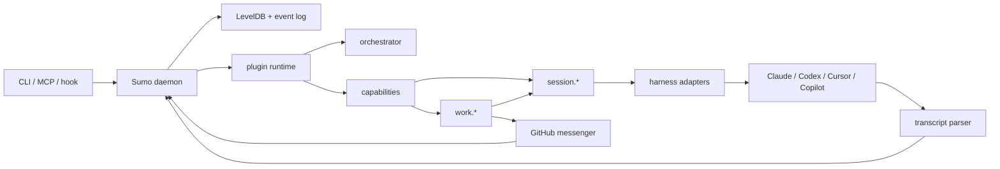

# 00 — Architecture Overview

> Front door for the package map and runtime data flow. If a more specific owning specification
> conflicts with this overview, the owning specification wins.

## Architecture

Sumo is a local-first orchestration kernel around existing agent CLIs. The daemon owns storage and
cross-process coordination; adapters surface external events and effects; the orchestrator is the only
actor; plugins provide policy and workflow.

## Package Map

| Package / area | Role |
|---|---|
| `packages/db` | Single-owner LevelDB daemon, KV API, event log, subscriptions, search, daemon lifecycle. |
| `packages/config` | Layered `sumo.yml` resolution and diagnostics. |
| `packages/plugin` | Runtime facade, event observers, steering waterfall, command registration. |
| `packages/capability` | Single capability definition projected to CLI/MCP/programmatic surfaces. |
| `packages/cli` | Human entrypoint, hook forwarder, daemon host, generated capability commands. |
| `packages/mcp` | MCP projection of registered capabilities. |
| `packages/harness` | Claude, Codex, Cursor, and Copilot session adapters. |
| `packages/transcript` | Native transcript/frame parsing into Sumo event vocabulary. |
| `packages/agent-artifacts` | Transcript acquisition, tailing, import, and native-id correlation. |
| `packages/messenger` | Adapter-neutral work intake and claim/review/release primitives. |
| `plugins/github` | First messenger adapter, backed by GitHub issues and marker comments. |
| `packages/session` | First-party session capabilities and state-query scorers. |
| `packages/work` | First-party work-loop capabilities: detect, claim, run, review, release, released. |
| `packages/orchestrator` | Sole actor that owns live session handles and process control. |

## Data Flow

