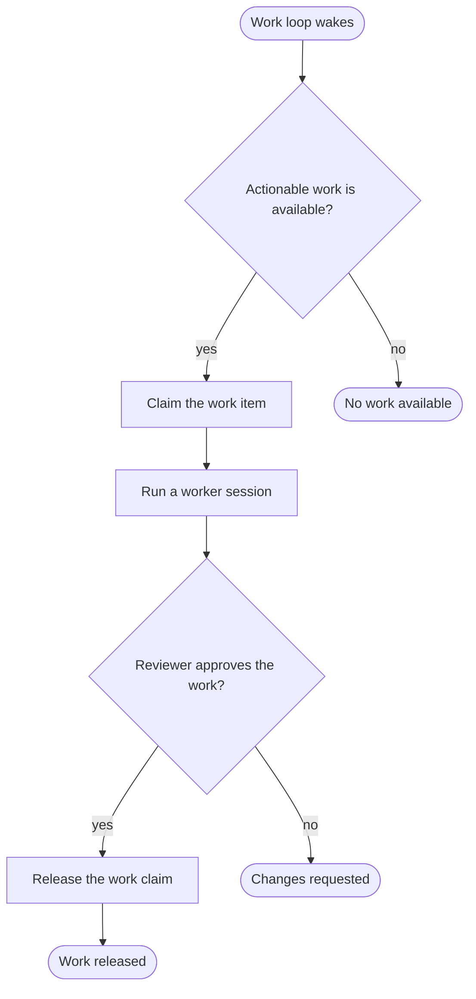

---
# CLAIM WORK REVIEW RELEASE — the first-person workflow vision that used to live as inline spike code.
#
# This graph is intentionally honest today: Sumo has the messenger substrate and session-control
# capabilities, but it does not yet expose first-party workflow capabilities for claim → run → review →
# release. The catalog lists those nodes as `work.*`; Melusine reports them as `todo` gaps until real
# capabilities land.
journey: claim-work-review-release
nodes:
  detectWork:
    use: work.detect
    source: github
  claimWork:
    use: work.claim
    as: work
  runWorker:
    use: work.run
    as: workerSession
    work: work
    role: worker
  reviewWork:
    use: work.review
    as: review
    work: work
    session: workerSession
  releaseWork:
    use: work.release
    work: work
  released:
    use: work.released
    work: work
  noWork:
    use: work.released
  changesRequested:
    use: work.released
---

# Claim work, run it, review it, release it

