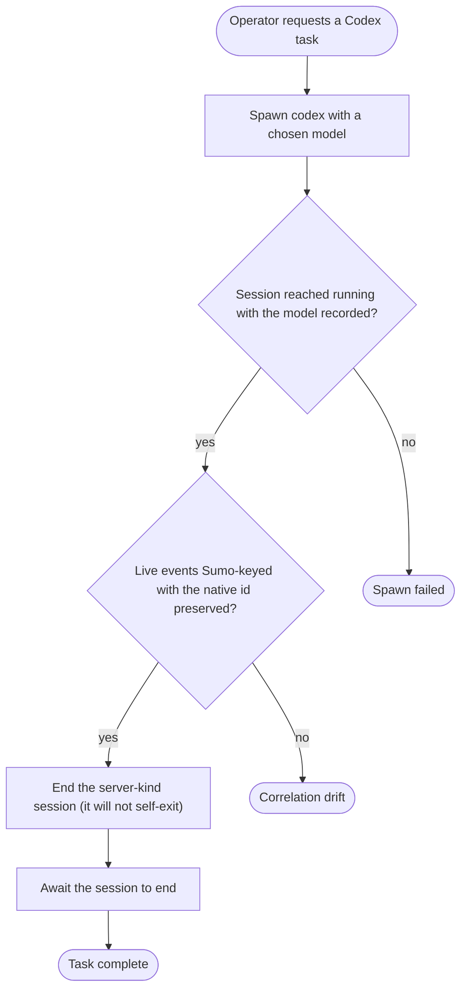

---
# CODEX WHOLE-TRAIL — spawn(codex) → task → drive-end → complete (the server-kind companion to Journey 1).
#
# Journey 1 proves the whole data trail for a PIPE-kind harness (Claude) that self-exits after a one-shot
# turn. Codex is a SERVER-kind harness: the app-server stays alive across turns, so `session.ended` only
# fires on transport close — the operator must DRIVE the end. This journey proves the same spine for that
# shape: spawn with a chosen model → running + model recorded → the live event stream is Sumo-keyed (the
# Sumo ulid is the spine, the native id is preserved in ext) → end the session → it reaches ended.
#
# Transcript+dedupe (Journey 1's `session-transcript-correlated`) is deliberately NOT asserted here:
# Codex's transcriptPath is filled by the agent-artifacts acquirer on tail-discovery, not at spawn, so the
# honest live assertion is `session-events-correlated` (stream correlation), per the 00c whole-trail plan.
#
# Coverage:  (model selection),  (human-facing session control),  (live handle),
#  (whole-trail e2e) for the server kind.
journey: codex-whole-trail
nodes:
  spawn:
    use: session-spawn
    as: session
    harness: codex
    model: gpt-5.5
    prompt: 'Reply with exactly one word: pong'
  running:
    use: session-is-running
    session: session
    expectModel: gpt-5.5
  correlated:
    use: session-events-correlated
    session: session
  driveEnd:
    use: session-end
    session: session
  awaitEnd:
    use: session-await-ended
    session: session
  completed:
    use: session-completed
    session: session
  spawnFailed:
    use: session-completed
    session: session
  drift:
    use: session-completed
    session: session
---

# Codex whole-trail — spawn (server kind), run, drive the end, complete

