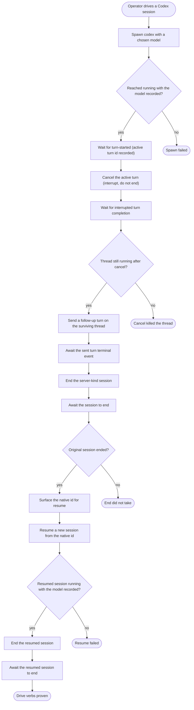

---
# DRIVE VERBS — cross-process session control on the server kind ().
#
# Proves the daemon-resident control path is driveable end-to-end from the human-facing surface, against
# Codex (SERVER kind, stays alive across turns — the shape that actually exercises cancel/send as
# distinct from teardown). The verbs, in order:
#   cancel  — interrupt the active turn WITHOUT ending the session (turn/interrupt). The thread must stay
#             alive (declare-don't-fake §3a): we assert it is still running, then prove it is still usable
#             by sending a follow-up turn on the surviving thread after the interrupted turn completes.
#   send    — submit a follow-up turn cross-process to the live handle and wait for its Codex turn to
#             reach a terminal state. The test proves the control-plane `turn/start`; it does not require
#             a successful assistant message because account quota can fail the model turn after send.
#   end     — gracefully end the (otherwise immortal) server-kind session; it then reaches `ended`.
#   resume  — start a NEW session from the ended one's native harness id (threaded via session-native-id,
#             since the native id is generated at runtime and cannot be hardcoded), and confirm it runs.
#             A live run surfaced the real constraint: Codex cannot resume from an EMPTY rollout, so the
#             follow-up turn must actually land before the session is ended — hence `sentCompleted`
#             between send and end (without it, resume fails with "rollout ... is empty").
#
# Cancel proof: the daemon event log must show the real `session.turn-started` event before
# `cancelTurn` runs. That is the same signal `CodexAppServer` uses to store the active turn id, so
# `session-cancel` must drive the live handle through `turn/interrupt`. The live test asserts the
# returned `{ interrupted:true }` result, which fails if the idempotent no-active-turn branch is taken.
#
# Coverage:  (cross-process drive),  (daemon-resident live handle).
journey: drive-verbs
nodes:
  spawn:
    use: session-spawn
    as: session
    harness: codex
    model: gpt-5.5
    prompt: 'Use the shell tool to run `python3 -c "import time; time.sleep(60)"`, then reply with exactly one word: done.'
  running:
    use: session-is-running
    session: session
    expectModel: gpt-5.5
  activeTurn:
    use: session-await-active-turn
    session: session
    timeoutMs: 30000
  cancelTurn:
    use: session-cancel
    session: session
  cancelCompleted:
    use: session-await-turn-completed
    session: session
    timeoutMs: 30000
  stillRunning:
    use: session-is-running
    session: session
  sendFollowup:
    use: session-send
    as: sentTurn
    session: session
    text: 'Reply with exactly one word: again'
  sentCompleted:
    use: session-await-turn-completed
    session: session
    turn: sentTurn
    timeoutMs: 120000
  driveEnd:
    use: session-end
    session: session
  awaitEnd:
    use: session-await-ended
    session: session
  endedOk:
    use: session-completed
    session: session
  getNative:
    use: session-native-id
    as: native
    session: session
  resume:
    use: session-resume
    as: resumedSession
    resumeFrom: native
    harness: codex
    model: gpt-5.5
    prompt: 'Reply with exactly one word: resumed'
  resumedRunning:
    use: session-is-running
    session: resumedSession
    expectModel: gpt-5.5
  endResumed:
    use: session-end
    session: resumedSession
  awaitResumedEnd:
    use: session-await-ended
    session: resumedSession
  resumedDone:
    use: session-completed
    session: resumedSession
  spawnFailed:
    use: session-completed
    session: session
  cancelKilled:
    use: session-completed
    session: session
  endFailed:
    use: session-completed
    session: session
  resumeFailed:
    use: session-completed
    session: resumedSession
---

# Drive verbs — cancel, send, end, resume (cross-process, server kind)

