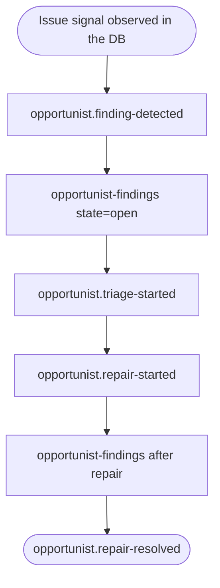

---
# P3 — Opportunist separate-agent triage and repair loop.
#
# The opportunist plugin watches the event DB for dismissive reasoning, records a finding, emits
# `opportunist.finding-detected`, waits for the parent session to reach a stable point, starts a
# separate triage session, and only starts repair when triage decides the finding should be fixed.
# Human closure uses the same finding ledger exposed through `opportunist-findings` and
# `opportunist-resolve`.
#
# HONEST BOUNDARY: the full observe → triage-agent → repair-agent path remains a live harness journey
# in `plugins/opportunist/test/e2e-codex.live.test.mjs` because the child agents must be real Sumo
# sessions, not test-only harnesses. This journey documents and validates the public capability/event
# shape without hiding it behind the package journey runner.
journey: p3-opportunist
nodes:
  findingDetected:
    use: opportunist-event
    event: opportunist.finding-detected
    reason: parent agent discovered but did not surface a lingering issue
  listOpenFindings:
    use: opportunist-findings
    state: open
    as: openFindings
  triageStarted:
    use: opportunist-event
    event: opportunist.triage-started
  repairStarted:
    use: opportunist-event
    event: opportunist.repair-started
  listAfterFix:
    use: opportunist-findings
    as: postRepairFindings
  resolved:
    use: opportunist-event-observed
    event: opportunist.repair-resolved
---

# P3 — Opportunist triage and repair loop

