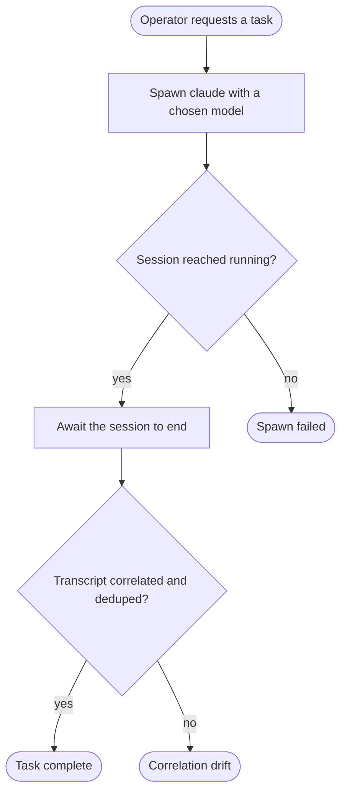

---
# JOURNEY 1 — spawn-with-model → task → complete (from the 00c e2e plan).
#
# An operator spawns a Claude session with a CHOSEN model, the agent works, the session ends, and the
# data trail (running → ended, transcript correlated/deduped) is asserted along the way. The headline
# "a human can actually run it" journey — almost entirely gaps today.
#
# Coverage:  (model selection),  (human-facing session control),  (live handle),
#  (whole-trail e2e test). Nodes reference building blocks via `use:`.
journey: spawn-with-model
nodes:
  spawn:
    use: session-spawn
    as: session
    harness: claude-code
    model: fast
    prompt: 'Reply with exactly one word: pong'
  running:
    use: session-is-running
    session: session
    expectTier: fast
  awaitEnd:
    use: session-await-ended
    session: session
  correlated:
    use: session-transcript-correlated
    session: session
  completed:
    use: session-completed
    session: session
  spawnFailed:
    use: session-completed
    session: session
  drift:
    use: session-completed
    session: session
---

# JOURNEY 1 — Spawn with model, run a task, complete

