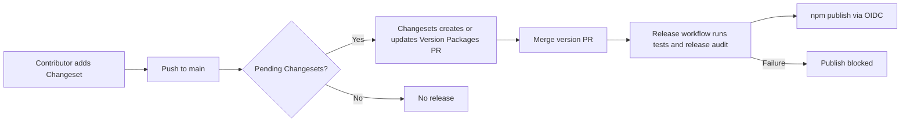

# Automated package publishing with Changesets and npm OIDC

## Goal Capsule

- Objective: Merged, release-bearing changes to Sumo are versioned and published to npm by GitHub Actions without a maintainer manually running a publish command.
- Means: Adopt the referenced Changesets release-PR workflow and npm Trusted Publishing/OIDC for the currently publishable root `sumo` package (KTD1, KTD2).
- Authority: Existing package/export boundaries and release audit are authoritative; npm and Changesets requirements constrain the workflow; this plan is limited to automation and release hygiene.
- Stop conditions: Do not make `packages/*` or `plugins/*` independently publishable in this change; do not publish until the one-time npm Trusted Publisher configuration is complete.
- Execution profile: Standard repository change with GitHub/npm account configuration as an explicit handoff prerequisite.

## Product Contract

### Summary

Sumo currently requires manual package publication even though its root package already defines the public runtime surface and a `prepublishOnly` release audit. Contributors need a durable way to declare release intent, while maintainers need the versioning and publication steps to run from a trusted, reproducible CI environment.

### Problem Frame

Without a release convention, changes can merge without a reliable version bump or changelog entry, and manual publication creates avoidable credential and process risk. The repository is a pnpm workspace, but only the root `sumo` manifest is currently an npm-publishable package; the workspace directories are source/export segments rather than independently versioned packages.

### Requirements

- R1. Contributors can add a Changeset describing the impact and release note for a change to the root `sumo` package.
- R2. A push to `main` with pending Changesets creates or updates a version PR that updates the root version and changelog; merging that PR returns the repository to the normal release loop.
- R3. A push to `main` after versioning publishes the root package through npm Trusted Publishing/OIDC, with no long-lived publish token stored in GitHub Actions.
- R4. The release job runs the existing test and `release:audit` gates through the root package’s existing `prepublishOnly` path before npm publication can succeed.
- R5. The workflow is serialized and least-privileged enough to prevent concurrent release races and to grant `contents`, pull-request, and OIDC permissions only where required.
- R6. The repository documents the contributor workflow, one-time npm/GitHub configuration, bootstrap treatment for the already-existing `1.0.0` package, and recovery path for failed releases.
- R7. Internal `packages/*` and `plugins/*` remain private implementation areas for this rollout and are not added to npm as separate packages.

### Key Decisions

- K1. Root package only (session-settled: user-directed — chosen over publishing all workspaces now: current workspace directories do not have publishable manifests). Governs R3, R7.

### Success Criteria

- A normal code change with a Changeset produces a single maintained `Version Packages` PR.
- Merging the version PR results in a successful npm publication of the intended root version and a tag/release record, without `NPM_TOKEN` or another write token.
- A change without release intent can merge using an empty Changeset or an explicitly documented no-release path.
- CI fails before publication when repository tests or the existing release audit fails.

### Scope Boundaries

- Deferred for later: independent manifests, versions, package names, changelogs, and publication workflows for `packages/*` or `plugins/*`.
- Deferred for later: automated release notes beyond Changesets’ generated changelog and GitHub release metadata.
- Outside scope: changing runtime package exports, restructuring the monorepo, or modifying the existing provenance/privacy audit rules except where release integration requires a test or documentation adjustment.

### Assumptions and Dependencies

- The GitHub repository is public and the npm package name `sumo` is owned by the maintainer account.
- GitHub Actions is permitted to create pull requests and push the version commit/tag to `main`.
- npm Trusted Publishing is configured for the exact repository, workflow file, branch/environment choice, and package name before the first automated publish.

## Planning Contract

### Key Technical Decisions

- KTD1. Use Changesets’ version-PR model rather than publishing every merge directly. This batches related changes, makes the version/changelog diff reviewable, and follows the referenced repository’s release flow.
- KTD2. Use npm Trusted Publishing/OIDC for publication. The release job receives `id-token: write`; npm authenticates the publish through the configured GitHub workflow and generates provenance automatically for this public package.
- KTD3. Keep one release workflow with the standard `changesets/action` orchestration for versioning and publishing, plus a separate guard workflow only if bootstrap detection is needed. Start with the smaller release workflow; add the guard only when it solves the pre-existing-package bootstrap gap without duplicating registry logic.
- KTD4. Keep `prepublishOnly` as the publication gate. Changesets invokes the package manager’s publish path, so the existing `pnpm test && pnpm run release:audit` remains the single release-quality boundary.
- KTD5. Configure Changesets to publish public packages on `main`, with no automatic local commits. Version PR automation owns the commit and PR; contributors own Changeset commits.

### High-Level Technical Design

The root `package.json` gains `@changesets/cli` and the three scripts needed by the action: create a Changeset, version packages, and publish packages. `.changeset/config.json` sets the public access mode, `main` base branch, standard changelog generator, and no ignored packages. The workflow checks out full history, installs with the frozen pnpm lockfile, and runs Changesets’ action on pushes to `main` with explicit GitHub contents/PR/OIDC permissions. On pending Changesets it creates or updates the version PR; on the version commit it invokes the publish command. The publish command reaches npm through OIDC and the root package’s existing `prepublishOnly` gate.

The one-time external setup is deliberately not encoded as a secret in the repository: configure npm Trusted Publishing for package `sumo` against the exact `.github/workflows/release.yml` workflow and `main` branch (or a named GitHub environment if approval is desired), verify repository settings allow Actions to create/approve pull requests, then run a controlled first release.

The release lifecycle is:

### Sequencing and Dependencies

1. Add Changesets metadata/scripts and contributor documentation while preserving the current package boundary.
2. Add and validate the release workflow against the existing lockfile, tests, audit, and package metadata.
3. Configure npm Trusted Publishing and GitHub Actions repository permissions outside the code diff.
4. Exercise the version-PR path with a real Changeset, merge the generated version PR, and verify publication, provenance, tag, and changelog behavior.
5. Add the publish guard only if the controlled bootstrap reveals that the pre-existing npm package needs a one-time missing-package diagnostic; do not make it a prerequisite for ordinary releases.

### Research Notes

- The referenced repository uses `.changeset/config.json`, `@changesets/cli`, root scripts for `changeset:version` and `changeset:publish`, and a `Release` workflow triggered by pushes to `main`.
- Current Changesets guidance requires repository checkout, the Changesets CLI, `contents: write`, `pull-requests: write`, and `id-token: write` when using trusted publishing; GitHub Actions must also be allowed to create and approve pull requests.
- Current npm guidance requires npm CLI 11.5.1+ and Node 22.14.0+ for Trusted Publishing. The CI runtime should therefore use a Node version at or above that floor even if the repository’s runtime engine remains unchanged.

## Implementation Units

### U1. Establish root-package Changesets configuration

- Goal: Make release intent and version/changelog generation available for the one publishable package.
- Requirements: R1, R5, R7.
- Files: `package.json`, `pnpm-lock.yaml`, `.changeset/config.json`, `.changeset/README.md` (only if generated or needed for local guidance).
- Approach: Add the Changesets CLI as a dev dependency; add `changeset`, `changeset:version`, and `changeset:publish` scripts; initialize public `main`-based Changesets configuration; ensure private workspace areas are not accidentally included as publishable packages.
- Test scenarios:
  - Changeset status identifies the root `sumo` package for a representative changeset.
  - Versioning updates the root version and changelog and consumes the changeset without changing runtime source files.
  - No package under `packages/*` or `plugins/*` is selected for publication.
- Verification: Run the Changesets status/version dry-run-equivalent checks without retaining generated release changes in the feature branch; inspect the resulting package selection and lockfile.

### U2. Add the GitHub Actions release loop

- Goal: Automate version PR creation/update and publication from `main`.
- Requirements: R2, R3, R4, R5.
- Files: `.github/workflows/release.yml`, optionally `.github/workflows/publish-guard.yml` if U3 establishes the bootstrap need.
- Approach: Follow the referenced workflow shape: full-history checkout, Node at the npm Trusted Publishing floor, Corepack/pnpm frozen install, `changesets/action` with the root version and publish scripts, explicit permissions, and concurrency protection. Keep publication in the same named workflow that npm Trusted Publishing is configured to trust. Use `NPM_CONFIG_PROVENANCE` only if needed by the selected npm/Changesets behavior; Trusted Publishing itself is the source of authentication and provenance.
- Test scenarios:
  - A push with pending changesets creates or updates one version PR.
  - A push with no pending changesets does not publish.
  - The publish path invokes `prepublishOnly`, and a failing test/audit prevents publication.
  - Workflow YAML has no npm write token, scopes OIDC permission correctly, and cannot run two releases concurrently for `main`.
- Verification: Validate workflow syntax and action inputs; run the repository’s narrow release checks locally; use a controlled GitHub Actions run for the real version-PR/publish behavior.

### U3. Complete bootstrap, documentation, and controlled rollout

- Goal: Make the first automated release operable and understandable.
- Requirements: R3, R6, R7.
- Files: `README.md` or a dedicated release section/documentation file selected during implementation; `.github/workflows/publish-guard.yml` only if the first-publish check is required; `CHANGELOG.md` if generated by versioning.
- Approach: Document how to add a changeset, how empty changesets cover no-release changes, who owns the version PR, the npm Trusted Publisher settings, required GitHub Actions permissions, and recovery when npm rejects a publish. Verify the already-published `1.0.0` state before enabling automatic publication; if package bootstrap cannot be verified in CI, add a small guard that reports missing registry packages and points to the one-time manual bootstrap rather than silently failing.
- Test scenarios:
  - Documentation names the root package as the only automated release target.
  - The configured npm Trusted Publisher matches repository, workflow filename, branch/environment, and package.
  - A controlled release produces the expected npm version, provenance indication, Git tag/release metadata, and changelog entry.
  - Re-running the workflow after a successful publication is idempotent and does not republish the same version.
- Verification: Check GitHub Actions logs and npm package metadata/provenance after the controlled release; record any external setup prerequisite that cannot be verified locally.

## Verification Contract

| Area | Required proof |
| --- | --- |
| Repository quality | `pnpm test` passes, including `release:audit` through `prepublishOnly` where invoked by the publish path. |
| Package boundary | `npm pack --dry-run --json --ignore-scripts` and `pnpm run release:audit` still report the expected root artifact and required runtime files. |
| Changesets | Local status/version checks select only `sumo`; generated version/changelog changes are reviewed before commit. |
| Workflow | YAML/action configuration review confirms full history, frozen install, Node/npm floor, explicit permissions, and concurrency behavior. |
| OIDC | A real GitHub Actions publish succeeds without `NPM_TOKEN`/write token and npm shows provenance for the public package. |
| Regression | Existing modified user files are not included in this work; unrelated dirty-tree changes remain untouched. |

## Definition of Done

- Changesets is installed and configured for the root package only.
- Contributors have a documented release-intent workflow and no-release path.
- The `main` workflow creates/updates version PRs and publishes merged versions through npm OIDC.
- Existing tests and `release:audit` remain publication gates.
- The first automated publication is verified, including package version, changelog, tag/release metadata, and npm provenance.
- No publish token is added to repository secrets or workflow files.
- Workspace packages/plugins remain deferred and are not accidentally published.
- Any bootstrap-only guard or experimental release artifact not required by the final workflow is removed before completion.

## Appendix

Reference material:

- [Changesets automation guide](https://github.com/changesets/changesets/blob/main/docs/automating-changesets.md)
- [Changesets Action requirements](https://github.com/changesets/action#readme)
- [npm Trusted Publishing](https://docs.npmjs.com/trusted-publishers/)
- [npm provenance statements](https://docs.npmjs.com/generating-provenance-statements/)
