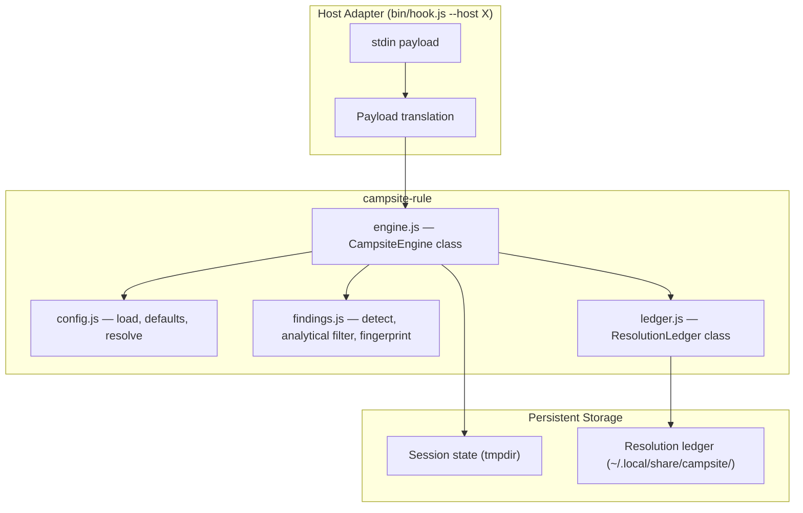
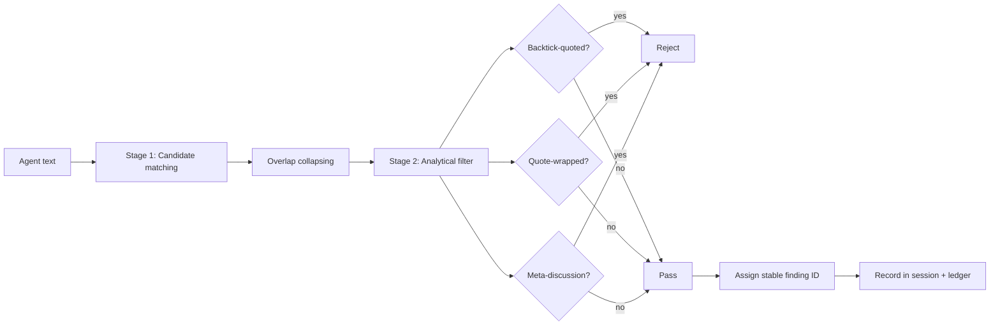
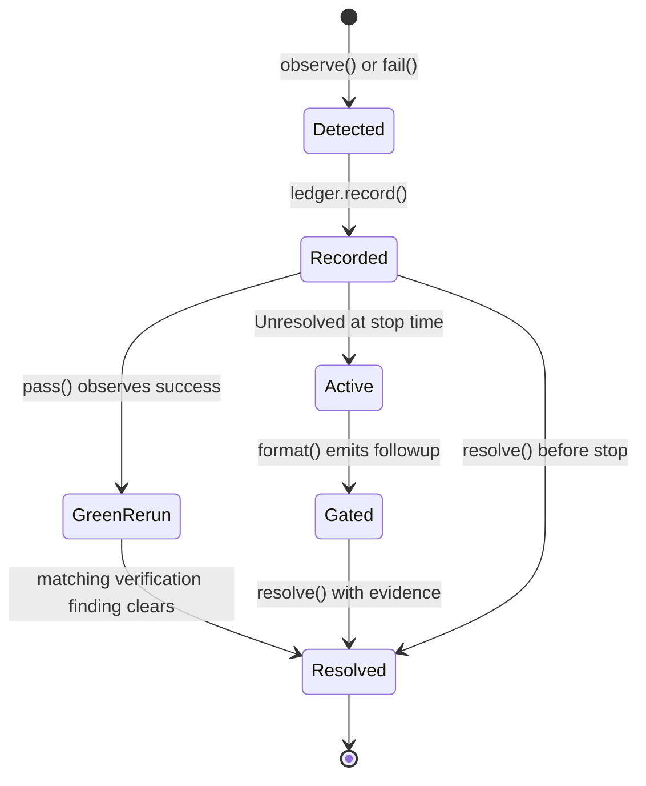

# campsite-rule

Campsite-rule enforcement engine for AI coding agent sessions. Detects dismissive
language, tracks verification failures, assigns stable finding IDs, filters false
positives from analytical discussion, and gates session completion until every
discovered issue is fixed, proven false-positive, or bypassed for a real
external blocker.

## Vision & Scope

This package enforces the campsite rule — leave every surface better than you
found it — by making silent dismissal structurally impossible. It is designed as
a standalone, host-agnostic engine that any IDE hook, CLI tool, or CI pipeline
can integrate with.

**What it does:**

- Detects dismissive rationalization phrases in agent output ("pre-existing",
  "separate concern", "not related to", etc.)
- Filters false positives from quoted, code-fenced, and meta-discussion context
- Assigns stable SHA-256 fingerprints to each finding so identical issues
  produce the same ID across sessions
- Tracks verification command failures (non-zero exit codes, timeouts, crashes)
- Maintains a persistent resolution ledger outside the repository for training
  and audit
- Gates session completion — unresolved findings block the stop event with
  actionable next steps
- Provides full configurability through a `"campsite"` key in `package.json`

**What it should NOT become:**

- A general-purpose linting engine. Detection is scoped to campsite-rule
  violations, not arbitrary code quality checks.
- A replacement for the campsite-rule skill. The engine enforces; the skill
  teaches. Agents must still read `SKILL.md` to understand the policy.
- A CI gating mechanism on its own. The engine provides findings; host adapters
  decide how to present or enforce them.

## Installation

Install Sumo once for programmatic use, hook adapters, and the bundled skill:

```sh
npm install sumo
```

```js
import { CampsiteEngine, resolveConfig } from 'sumo/plugins/campsite-rule';
```

The root package also exports the hook adapter as `sumo/plugins/campsite-rule/bin`. To install the
agent skill, copy the packaged `plugins/campsite-rule` directory into
`.agents/skills/campsite-rule/`; keep `SKILL.md`, `bin/`, `src/`, `references/`, and `hooks.json`
together. The engine uses only Node.js standard-library APIs and supports Sumo's Node `>=22.13.0`
runtime target. Campsite Rule is not published as a standalone npm package.

### Wiring IDE hooks

The shared adapter lives at `.agents/skills/campsite-rule/bin/hook.js`. Pass
`--host cursor` or `--host claude`, point `--repo` at the repository root, then
append the hook mode as the final argument (for example `session-start`).

**Cursor** — register hooks in `.cursor/hooks.json` so each lifecycle event
invokes the adapter:

```json
{
  "version": 1,
  "hooks": {
    "sessionStart": [{ "command": "node .agents/skills/campsite-rule/bin/hook.js --host cursor --repo . session-start" }],
    "postToolUse": [{ "command": "node .agents/skills/campsite-rule/bin/hook.js --host cursor --repo . tool-success", "matcher": "Shell" }],
    "postToolUseFailure": [{ "command": "node .agents/skills/campsite-rule/bin/hook.js --host cursor --repo . tool-failure", "matcher": "Shell" }],
    "afterAgentResponse": [{ "command": "node .agents/skills/campsite-rule/bin/hook.js --host cursor --repo . agent-response" }],
    "stop": [{ "command": "node .agents/skills/campsite-rule/bin/hook.js --host cursor --repo . stop" }]
  }
}
```

**Claude Code** — register matching hooks in `.claude/settings.json` (nested
`hooks` with `type: "command"` entries as required by that host):

```json
{
  "hooks": {
    "SessionStart": [{ "matcher": "startup|clear|compact", "hooks": [{ "type": "command", "command": "node .agents/skills/campsite-rule/bin/hook.js --host claude --repo \"$CLAUDE_PROJECT_DIR\" session-start" }] }],
    "PreToolUse": [{ "matcher": "Bash", "hooks": [{ "type": "command", "command": "node .agents/skills/campsite-rule/bin/hook.js --host claude --repo \"$CLAUDE_PROJECT_DIR\" pretool" }] }],
    "PostToolUse": [{ "matcher": "Bash", "hooks": [{ "type": "command", "command": "node .agents/skills/campsite-rule/bin/hook.js --host claude --repo \"$CLAUDE_PROJECT_DIR\" tool-success" }] }],
    "PostToolUseFailure": [{ "matcher": "Bash", "hooks": [{ "type": "command", "command": "node .agents/skills/campsite-rule/bin/hook.js --host claude --repo \"$CLAUDE_PROJECT_DIR\" tool-failure" }] }],
    "SubagentStop": [{ "hooks": [{ "type": "command", "command": "node .agents/skills/campsite-rule/bin/hook.js --host claude --repo \"$CLAUDE_PROJECT_DIR\" subagent-stop" }] }],
    "Stop": [{ "hooks": [{ "type": "command", "command": "node .agents/skills/campsite-rule/bin/hook.js --host claude --repo \"$CLAUDE_PROJECT_DIR\" stop" }] }]
  }
}
```

## Architecture



### Detection Pipeline



### Finding Lifecycle



## Usage

```js
import { CampsiteEngine } from 'campsite-rule';

const statePath = CampsiteEngine.resolve({ session_id: 'abc-123' });
const engine = new CampsiteEngine({ statePath, repo: process.cwd() });

await engine.start();

const hits = await engine.observe(
  'That Docker failure is not related to our changes.',
  'response'
);

const message = await engine.format();
// → "Campsite hook flagged 1 concrete issue to resolve before completion. ..."

await engine.resolve(hits[0].id, {
  classification: 'fixed',
  evidence: 'src/engine.js',
  subject: 'policy-docs',
  session: 'abc-123'
});

const after = await engine.format();
// → null (all resolved)
```

## API

### `CampsiteEngine`

Core orchestration class. Each instance tracks findings for one session.

#### `constructor({ statePath, repo, config })`

| Parameter | Type | Required | Description |
|-----------|------|----------|-------------|
| `statePath` | `string \| null` | yes | Session state file path from `resolve()` |
| `repo` | `string` | no | Repository root for ledger and config discovery |
| `config` | `object` | no | Pre-resolved config. Auto-discovered when omitted |

#### `static resolve(input, stateConfig?)` → `string | null`

Derive a state file path from a hook payload's `session_id`. Returns `null`
when no session context is available.

#### `start()` → `Promise<void>`

Initialize a clean session by removing stale state.

#### `observe(text, source)` → `Promise<object[]>`

Scan text for dismissive language. Returns newly detected findings. Each finding
is persisted to both session state and the resolution ledger.

#### `fail(input, command, failureType, error)` → `Promise<object>`

Record a verification failure.

#### `pass(command?)` → `Promise<void>`

Clear verification failures for a matching green rerun. Non-verification
findings remain active until resolved explicitly.

#### `active()` → `Promise<object[]>`

Return findings that remain unresolved after subtracting ledger proofs.

#### `resolve(id, proof)` → `Promise<void>`

Mark a finding as resolved. The proof must include `classification` and
`evidence`; `session`, `model`, and `effort` are optional metadata. `fixed`
proofs accept subject-specific fields such as `subject`,
`relatedFindingId`, `verificationCommand`, `verificationEvidence`, and
`testEvidence`, and validate those fields when supplied.

#### `format()` → `Promise<string | null>`

Build the stop followup message. Returns `null` when all findings are resolved.

#### `config` → `object`

The frozen config object driving this engine instance.

#### `ledger` → `ResolutionLedger`

Direct access to the resolution ledger.

### `ResolutionLedger`

Persistent finding lifecycle storage, one instance per repository.

#### `constructor(repo, config?)`

| Parameter | Type | Required | Description |
|-----------|------|----------|-------------|
| `repo` | `string` | no | Repository root. Defaults to `process.cwd()` |
| `config` | `object` | no | Full config object or `{ baseDir, fileName }` overrides |

#### `record(id, finding)` → `Promise<void>`

Store initial finding context at detection time.

#### `prove(id, proof)` → `Promise<void>`

Merge resolution proof into an existing ledger entry.

#### `proven(id)` → `Promise<object | null>`

Return the entry only if resolved (classification is not null).

#### `lookup(id)` → `Promise<object | null>`

Return the full ledger entry whether resolved or not.

### Detection Functions

| Export | Signature | Description |
|--------|-----------|-------------|
| `detect` | `(text, source, config?) → object[]` | Full two-stage pipeline |
| `candidates` | `(text, source, config?) → object[]` | Stage 1 only (before filtering) |
| `analytical` | `(text, offset, length, config?) → boolean` | Stage 2 filter check |
| `fingerprint` | `(finding) → string` | 16-char hex finding ID |
| `verification` | `(input, command, failureType, error) → object` | Build a verification finding |
| `migrate` | `(state) → object[]` | Convert legacy state to finding records |

### Config Utilities

| Export | Signature | Description |
|--------|-----------|-------------|
| `configDefaults` | `() → object` | Full default config |
| `loadConfig` | `(root) → object \| null` | Load raw `campsite` key from nearest `package.json` |
| `resolveConfig` | `(root?) → object` | Defaults + user config, deep-merged and frozen |

## Configuration

All values are optional. Add a `"campsite"` key to the nearest ancestor
`package.json` to override defaults:

```jsonc
{
  "campsite": {
    "detection": {
      "phrases": ["pre-existing", "not related to", "..."],
      "metaTokens": ["flagg", "detect", "trigger", "..."],
      "metaTokenThreshold": 2,
      "snippetRadius": 48,
      "metaParagraphFallback": 120,
      "backtickScanRadius": 200,
      "quoteLookaround": 4
    },
    "snapshot": {
      "contextRadius": 500,
      "paragraphDelimiter": "\n\n"
    },
    "ledger": {
      "baseDir": "~/.local/share/campsite",
      "fileName": "ledger.json"
    },
    "state": {
      "directory": null,
      "filePrefix": "campsite-"
    },
    "verification": {
      "patterns": ["bin/onboard\\s+(up|test|build|lint)\\b"],
      "successExitCodes": [0],
      "ignoredFailureTypes": ["permission_denied"]
    },
    "resolve": {
      "classifications": ["fixed", "triaged", "false-positive", "bypassed"],
      "subjects": ["policy-docs", "verification", "implementation"],
      "minEvidenceLength": 12,
      "maxIdenticalEvidence": null,
      "minModelLength": 3,
      "requireModel": false,
      "requireEffort": false,
      "verifyArtifacts": true,
      "escalationThresholds": [2, 3]
    },
    "format": {
      "stopIntro": "Campsite hook flagged {count} concrete issue{s} to resolve before completion.",
      "skillPath": ".agents/skills/campsite-rule/SKILL.md",
      "resolveCli": "node .agents/skills/campsite-rule/bin/hook.js --repo . resolve",
      "sourceLabels": { "thought": "agent thought", "response": "agent response" }
    }
  }
}
```

### Config Resolution

The engine walks up from the repository root to find the nearest `package.json`
containing a `"campsite"` key. User values are deep-merged over built-in
defaults. Arrays replace entirely (not concatenate) so you can fully override
the phrase list. The result is deep-frozen.

Tilde (`~`) in `ledger.baseDir` and `state.directory` expands to `$HOME`.

### Key Configuration Decisions

| Section | Key | What it controls |
|---------|-----|------------------|
| `detection.phrases` | Which phrases trigger findings | Replace to customize vocabulary |
| `detection.metaTokenThreshold` | How many meta tokens suppress a match | Raise to allow more analytical discussion |
| `snapshot.contextRadius` | Paragraph extraction fallback radius | Increase for richer training data |
| `ledger.baseDir` | Where resolution proofs are stored | Change for shared or CI-accessible storage |
| `verification.patterns` | Which commands count as verification | Add patterns for project-specific tools |
| `resolve.maxIdenticalEvidence` | Optional evidence reuse limit | Set when a repo wants stricter local auditing |
| `resolve.subjects` | Which optional fixed-proof subjects are accepted for dismissive findings | Extend only when you can validate the new proof type |
| `resolve.escalationThresholds` | When repeated stop prompts escalate | Tune how quickly the warning becomes forceful |
| `format.skillPath` | Skill path in the stop message | Change when the skill lives elsewhere |

## Testing

```js
import { describe, it, expect, beforeEach, afterEach } from 'vitest';
import { mkdtemp, rm } from 'node:fs/promises';
import { tmpdir } from 'node:os';
import { join } from 'node:path';
import { CampsiteEngine } from 'campsite-rule';
import { defaults } from 'campsite-rule';

let tempDir, statePath;

beforeEach(async function setup() {
  tempDir = await mkdtemp(join(tmpdir(), 'campsite-test-'));
  statePath = join(tempDir, 'state.json');
});

afterEach(async function cleanup() {
  await rm(tempDir, { recursive: true, force: true });
});

it('detects dismissive language', async function detect() {
  const engine = new CampsiteEngine({ statePath, repo: tempDir });
  const hits = await engine.observe('This is a separate concern.', 'response');

  expect(hits).toContainEqual(
    expect.objectContaining({ phrase: 'separate concern' })
  );
});

it('uses custom phrases from config', async function custom() {
  const config = {
    ...defaults(),
    detection: { ...defaults().detection, phrases: ['team problem'] }
  };
  const engine = new CampsiteEngine({ statePath, repo: tempDir, config });
  const hits = await engine.observe('That is a team problem.', 'response');

  expect(hits).toContainEqual(
    expect.objectContaining({ phrase: 'team problem' })
  );
});
```

Run the test suite:

```sh
bin/onboard run test-skills
```

## Resolving Findings

The engine assigns a stable ID to each finding. Resolve findings explicitly
so the stop gate no longer blocks:

```sh
echo '{"findingId":"<id>","classification":"fixed|triaged|false-positive|bypassed","evidence":"<artifact path, sha, issue, command trace, or outage trace>","subject":"policy-docs|verification|implementation","relatedFindingId":"<finding id when useful>","verificationCommand":"<rerun command when useful>","verificationEvidence":"<passing rerun artifact when useful>","testEvidence":"<regression test artifact when useful>"}' \
  | node .agents/skills/campsite-rule/bin/hook.js --repo . resolve
```

Only include extra proof fields when they add useful context. `model` and
`effort` are optional self-reported metadata.

| Classification | When to use |
|---------------|-------------|
| `fixed` | The underlying bug is actually handled now and the evidence points to a real artifact |
| `triaged` | A bounded investigation produced a concrete trace, follow-up, or user-sequencing note |
| `false-positive` | The detection was wrong because the phrase was quoted, fenced, or clearly campsite-meta |
| `bypassed` | A real external outage or unavailable dependency prevents safe progress, and the evidence names that condition |

Resolution proofs are stored in the ledger at `~/.local/share/campsite/`
(configurable via `ledger.baseDir`). Each entry captures the finding context at
detection time and merges the resolution proof at resolve time, producing
labeled training data for skill and prompt improvement.

### Resolution rules

- Fixing the discovered issue is the priority. Do not prefer your original task over a concrete defect you have now seen.
- Raw resolve payloads always require `findingId`, `classification`, and `evidence`. `requireModel` and `requireEffort` can opt a repo back into self-reported attribution fields.
- `fixed` evidence is validated. Real file paths are checked on disk and commit SHAs are checked against git history.
- Verification reruns clear matching verification findings automatically. When `verificationCommand` and `verificationEvidence` are supplied, the evidence artifact must show the same command later exiting `0`.
- Dismissive findings may declare `subject` when the evidence is clearer with `policy-docs`, `verification`, or `implementation` context.
- Dismissive `subject: "verification"` fixes may use `relatedFindingId` to point at a resolved verification finding.
- Dismissive `subject: "implementation"` fixes may include `testEvidence`, `verificationCommand`, and `verificationEvidence`; supplied artifacts are validated.
- Dismissive `subject: "policy-docs"` fixes require an actual policy or documentation change, not a plan or placeholder comment.
- Placeholder evidence like `abc`, vague prose, or copied boilerplate is rejected.
- The same evidence string can be reused by default when findings share a root cause. Set `resolve.maxIdenticalEvidence` to enforce a local reuse limit.
- `TodoWrite`, TODO comments, issue links, and plan files can support the record, but they do not close runtime or verification bugs by themselves.
- `bypassed` is narrow by design. Use it only when an outage or external dependency failure makes a code change unsafe. "Someone else owns this" or "not part of this task" is not a bypass reason.
- Dirty working trees still require triage. If a file is modified but untouched by your current edits, inspect the diff and describe the concrete change instead of calling it `pre-existing` or `unrelated`. Prefer wording like "`package.json` is modified and `git diff` adds `vitest`" over provenance labels. Who changed the file or when it became modified is not proof.

## Integration

### IDE hooks

The shared adapter at `.agents/skills/campsite-rule/bin/hook.js` translates IDE
lifecycle events into engine calls. Cursor wires six modes: `session-start`,
`tool-success`, `tool-failure`, `agent-response`, `stop`, and `resolve`. The
adapter still accepts `agent-thought` as a no-op for older configs. Claude Code
uses `session-start`, `pretool`, `tool-success`, `tool-failure`,
`subagent-stop`, `stop`, and `resolve`. Claude scans only the latest visible
assistant text at stop time, gates subagent completion via `SubagentStop`, and
blocks test commands with descriptive reasons via `PreToolUse`.

### Custom Adapters

Build your own adapter by importing `CampsiteEngine`:

```js
import { CampsiteEngine, resolveConfig } from 'campsite-rule';

const config = resolveConfig('/path/to/repo');
const engine = new CampsiteEngine({
  statePath: '/tmp/my-session.json',
  repo: '/path/to/repo',
  config
});

// Wire into your lifecycle events
await engine.observe(agentText, 'response');
const message = await engine.format();
```

## File Structure

```
.agents/skills/campsite-rule/
├── SKILL.md              Policy document — what agents read
├── README.md             This file — package documentation
├── package.json          Package manifest
├── bin/
│   └── hook.js            Shared IDE hook adapter (--host cursor|claude)
├── src/
│   ├── index.js          Public API barrel
│   ├── engine.js         CampsiteEngine class
│   ├── findings.js       Detection pipeline and finding identity
│   ├── ledger.js         ResolutionLedger class
│   └── config.js         Configuration discovery and defaults
├── test/
│   ├── engine.test.js    Engine integration tests
│   ├── config.test.js    Configuration tests
│   ├── verify.test.js    Skill fixture verification
│   ├── README.md         Test fixture documentation
│   └── fixtures/         Pressure scenario fixtures
└── references/
    ├── opportunistic-refactoring.md
    └── external-patterns.md
```
