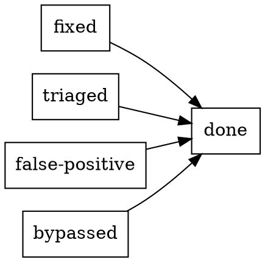

<!-- cspell:ignore rankdir triaging -->

# Campsite Rule

## Overview

Apply the campsite rule to every surface you touch: leave it better than you
found it. "Pre-existing" explains when a problem started. It does **not**
justify stepping over it once you have seen it.

This is the same family of opportunistic cleanup Martin Fowler describes in
[Opportunistic Refactoring](https://martinfowler.com/bliki/OpportunisticRefactoring.html):
fix or bound what you discover while you are already in the code, instead of
using provenance as an excuse to walk past it. For the repo-local source note,
see `references/opportunistic-refactoring.md`.

The failure mode this skill corrects is user-pleasing tunnel vision. Agents want to finish the requested task, avoid surprising the user, and avoid rabbit holes. Under that pressure they rationalize:

- "This is pre-existing"
- "This is unrelated"
- "That is a separate concern" / "separate issue"
- "The user did not ask for this"
- "I should stay focused"
- "I will mention it later"

Those phrases feel disciplined. Usually they are just excuses for inaction.

**Foundational rule:** once you discover a concrete bug or blocker, honest
closure now means one of three endings: `fixed`, `false-positive`, or
`bypassed`. `fixed` means the underlying bug is actually handled. Plans,
TODO comments, issue links, and doc notes may accompany the record, but they
do **not** close the bug by themselves.

You do **not** have to sweep speculative tech debt. You **do** have to close
the concrete bugs you discover while doing the work.

## When This Applies

- Verification or setup fails on something you believe predates your change
- A verification command turns red and you feel tempted to separate the
  requested task from the failing result
- Errors, warnings, or stack traces appear in verification output even though
  the suite exits zero — a green exit code does not make runtime errors invisible
- You see a `TODO`, `FIXME`, or `HACK` in the exact file, doc, or workflow surface you are already touching
- A stale doc, misleading comment, or workaround explains why the current task is confusing
- You notice a nearby defect that looks local and safe, but you want to avoid scope creep
- A verification command fails and you re-run it — the passing second run does
  not retroactively triage the first failure
- You are about to report verification results by combining outcomes from
  multiple runs into a single summary
- You are about to say "pre-existing", "unrelated", "separate concern", "separate issue", "out of scope", "not my task", or "I will mention it in the final message"

## When This Does Not Apply

- Speculative cleanup not tied to a concrete issue you actually encountered
- Broad rewrites or tech-debt sweeps discovered second-hand rather than through the current task
- Backlog grooming or prioritization work where the point is to plan debt, not act on an encountered problem

## Quick Reference

| Situation | Default action |
| --------- | -------------- |
| Blocks setup, verification, or a truthful completion claim | Fix now |
| Errors or stack traces in verification output despite green exit | Investigate now — route through `systematic-debugging` before classifying |
| Verification failed, then passed on re-run | Triage the original failure before reporting the green result |
| Same file, doc, or workflow surface and safe/mechanical | Fix now |
| Cross-cutting, risky, or materially larger than the current change | Keep working until it is fixed, or stop and ask the user how to proceed; only true external blockers bypass |
| User explicitly says not to fix it | Obey, but disclose the risk and make sure the issue is not silently forgotten |
| Only action is "I will mention it later" | Not enough |

## Step 1: Classify The Issue

Classify the discovered issue with three questions, in this order:

### 1. Is it blocking?

If the issue blocks setup, verification, or an honest status claim, it is now part of the task. You do not get to call work complete while stepping over the blocker.

A **green exit code does not clear you.** Errors, warnings, and stack traces in verification output are issues you have now seen. If an error appears in stderr during `bin/onboard test` but the suite exits zero, you have discovered a runtime error that needs investigation — not a pass you can celebrate.

Examples:

- `bin/onboard test` fails before you can verify your change
- A known bug prevents reproducing the behavior you are supposed to fix
- Stale docs prevent you from stating intended behavior confidently
- An `EPIPE`, `ECONNRESET`, or unhandled error appears in test output despite all tests passing
- A Docker, port, network, or environment failure prevents a test suite from running

**Re-running does not rewrite history.** If verification fails and you re-run
the same command, the second run's green result clears the hook reminder, but it
does not explain why the first run went red. Before reporting the passing
result, state what failed, what passed on rerun, and whether the first failure
was fixed, triaged, or bypassed. Reporting only the second run's result — or
combining results from multiple runs into a single "zero failures" summary — is
falsifying the verification record.

### 2. Is it local?

If the issue lives in the exact file, module, doc section, or workflow step you are already editing, and the fix is local and safe, fix it now.

Nearby defects are not exempt just because the prompt did not spell them out. If you are already inside the exact surface, local cleanup is part of finishing well.

### 3. Is it risky?

If the fix is cross-cutting, speculative, or likely to widen scope materially, do **not** silently defer it. Choose the smallest meaningful improvement you can make right now, then leave a durable handoff.

Risk changes **how** you act. It does not justify acting like nothing happened.

## Step 2: Choose Honest Closure

There are four honest ways to close a discovered finding:



### `fixed` is the default

Use `fixed` when the underlying bug is actually handled now.

Fix the issue immediately when any of these are true:

- It blocks truthful completion
- It is local to the exact surface you are touching
- The fix is safe, mechanical, and proportionate

Evidence depends on the bug you found:

- **Verification finding**: rerun the same command successfully, or record the
  command trace that explains why it needs user sequencing.
- **Dismissive finding about verification**: link it to the verification trace
  when that relationship clarifies the closure.
- **Dismissive finding about implementation behavior**: land the fix, then add
  regression and verification evidence when they are proportionate.
- **Dismissive finding about policy or docs**: change the actual skill, README,
  comment, or doc surface that was wrong.

### Investigate until you can close it honestly

When the discovered issue is a runtime error, unexpected behavior, or a defect
you do not fully understand, route through `systematic-debugging` and complete
at least Phase 1 (`Root Cause Investigation`) before choosing `fixed`,
`triaged`, `false-positive`, or `bypassed`.

Investigation is not an alternative to fixing. It is the work required to reach
an honest closure state.

A workaround, TODO, or test plan built on symptoms without a root-cause
diagnosis is still guesswork.

### `triaged` is for bounded investigation

Use `triaged` when you investigated the issue, recorded the concrete state, and
the honest next step is bounded follow-up or user sequencing rather than more
silent agent work. `triaged` is not a softer spelling of "ignore"; it needs an
artifact, command trace, issue, or specific observation.

Use `triaged` for cross-cutting issues, broad environment mismatches, or
multi-owner work only after you can say what happened and why you are stopping.

### `false-positive` is narrow

Use `false-positive` only when the detector was wrong because the flagged
phrase was quoted, fenced, or clearly campsite-meta. `false-positive` is about
the detection being wrong, not about the bug being inconvenient.

### `bypassed` is only for real external blockers

Use `bypassed` only when a real external outage or unavailable dependency makes
a code change unsafe. `bypassed` is not "too big", "someone else owns it",
"I should stay focused", or "I filed an issue."

### What does **not** count

These do **not** close a discovered bug:

- mentioning the issue only in your final response
- writing "pre-existing" and moving on
- assuming CI, reviewers, or the next agent will deal with it
- treating disclosure with no artifact as sufficient
- adding a TODO comment, issue link, or plan file instead of fixing the bug
- using a documentation update to close a runtime or verification bug
- re-running a failed verification command and reporting only the passing result
- combining results from multiple partial runs to construct a "zero failures" narrative
- labeling an infrastructure failure (Docker, port, network) "unrelated" without routing to `onboarding`
- calling an error "cosmetic" or "benign" without evidence from source code

## Step 3: Route To The Owning Skill

`campsite-rule` decides **whether** action is required. The owning domain skill still decides **how** that action must be performed.

Route by issue type:

- Runtime errors, unexpected behavior, or defects you do not fully understand -> `systematic-debugging` (complete Phase 1 before choosing fixed vs triaged)
- Environment, setup, Docker, local verification, or workflow execution -> `onboarding`
- Failing tests, regressions, or missing verification -> `testing-standards`
- Stale package READMEs, wrong comments, missing JSDoc, or package-doc drift -> `documentation-standards`
- Stale architecture docs, runbooks, integration docs, or system-level doc drift -> `system-documentation`
- Dead code, workarounds, cleanup, or structural simplification -> `refactoring`
- New logic, adapters, parsers, or dependency choices -> `open-source-mindset`
- Package placement or workspace structure changes -> `architecture-standards`
- CI readiness, commit scope, push readiness, or branch hygiene -> `repository-governance`
- Skills, standards, `AGENTS.md`, or repo conventions -> `maintaining-standards`

Never use this skill to bypass a stronger hard gate from the owning skill. For example:

- If fixing the discovered issue requires new logic, `open-source-mindset` still requires package search first
- If the issue appears during verification, `onboarding` still controls how tests and setup commands are run
- If the issue affects push readiness or unrelated failing verification, `repository-governance` still controls what counts as complete
- If the issue requires changing a skill, standard, or routing rule, `maintaining-standards` still owns that work

## Example

You are editing `packages/logger/src/index.js` for a small change and notice a nearby `FIXME` describing a real defect.

- The issue is in the exact file you are already touching
- The fix looks local and safe
- It adds 20-30 minutes

Do **not** say "scope creep", leave the `FIXME`, and mention it later.

This is a **local** issue, not a speculative refactor. Fix it now, then verify through the owning skill.

By contrast, you run `bin/onboard test` and the apps suite fails with a Docker
port conflict. You call the conflicting container "unrelated" and re-run. The
second run passes.

Do **not** combine the passing suites from run 1 with the passing apps from
run 2 and report "zero failures." Run 1 failed. That failure needs triage:
what container was conflicting, why, and whether the environment is reliable.
Route through `onboarding` for the infrastructure issue. Only then may you
report a clean verification.

If `bin/onboard test` exposes a cross-platform Docker mismatch that clearly
needs broader onboarding work, do **not** report the task as fully verified.
Keep working until the blocker is fixed, or stop and ask the user how to
proceed. If you stop, resolve the finding as `triaged` with the concrete trace
that explains the handoff.

## Red Flags - STOP and Act

| Signal | Action |
| ------ | ------ |
| Saying "this is pre-existing" | STOP - provenance does not remove responsibility after discovery |
| Saying "the user did not ask for this" | STOP - users do not ask for hidden defects because they cannot see them |
| Planning to mention the issue only in the final response | STOP - take real action now |
| Calling a nearby safe fix "scope creep" | STOP - local safe issues are part of finishing well |
| Saying a docs-only change can ignore failing verification | STOP - truthful completion still requires triage |
| Letting a cross-cutting issue consume the whole task | STOP - either fix it or stop and ask the user how to proceed; do not claim completion while it stays open |
| Labeling a discovered problem "separate concern" or "separate issue" to skip triage | STOP - close it as `fixed`, `triaged`, `false-positive`, or `bypassed` |
| Using this skill to skip package search or `bin/onboard` | STOP - owning skill hard gates still apply |
| Calling an error "benign" or "cosmetic" without reading source code | STOP - investigate through `systematic-debugging` before labeling severity |
| Tests pass but stderr shows errors or stack traces | STOP - a green exit code is not permission to ignore runtime errors |
| Verification failed repeatedly or produced unexplained errors | STOP — route to `onboarding` and record what you proved before claiming completion |
| Presenting combined results from multiple runs as a single summary | STOP — each verification run stands alone; combining constructs a false narrative |
| Calling a Docker, port, or environment failure "unrelated" | STOP — infrastructure failures during verification are blocking; route to `onboarding` |
| Treating a TODO, issue, or plan as closure for a discovered bug | STOP - those artifacts can record sequencing, but use `triaged` only after a bounded investigation |
| Choosing documentation-only evidence for a live runtime or verification bug | STOP - docs can fix policy defects, not excuse unfixed behavior |

## Rationalization Table

| Excuse | Reality |
| ------ | ------- |
| "It is pre-existing" | Pre-existing explains blame, not why you should leave the problem untouched after discovering it |
| "It is unrelated" | Unrelated to the original ask does not mean unrelated to honest completion |
| "It is a separate concern" / "separate issue" | Partitioning the narrative does not remove the duty to triage what you already saw |
| "The user did not ask me to fix this" | The user asked for help, not permission to step over defects they cannot see |
| "I should stay focused" | Focus means closing the bug you discovered, not pretending it is not there |
| "I will mention it later" | Non-durable warnings disappear; take a real action now |
| "This would surprise the user" | Silent scope expansion is bad, but explicit scoped improvement is better than silent deferral |
| "Someone else owns this package" | Ownership can limit the size of the fix, never the duty to disclose and act proportionately |
| "This is only a docs change" | Docs, tests, and verification still define whether the work is honestly complete |
| "I cannot fix the whole thing right now" | Then keep working or stop and ask the user how to proceed — do not close it with a softer label |
| "Tests pass, so it is fine" | Exit code zero means the assertions passed, not that there are no problems — errors in output are issues you have now seen |
| "It is cosmetic / benign / noise" | These are severity labels that require evidence, not intuition — read the source code before labeling |
| "I will just add a TODO" | A TODO comment is not bug closure |
| "An issue link or plan file is enough" | Tracking the bug is not the same as fixing it |
| "A durable trace is good enough" | A trace supports `triaged` only after bounded investigation; it is not a synonym for ignoring the issue |
| "This is an upstream issue" | Upstream explains where the fix belongs, not whether you should investigate — check for existing issues, test workarounds, and document what you learned |
| "It passed on the second run" | A green re-run clears the hook reminder, but say exactly which command passed and avoid blending multiple runs into one story |
| "It was a flaky environment issue" | "Flaky" is a symptom; record the rerun, timeout, or environment evidence you actually saw |
| "It was just a Docker / port conflict" | Infrastructure failures during verification need bounded triage through `onboarding`, not dismissal |

## Resolving Findings

The campsite hook assigns a stable finding ID to each detected issue.  When
you address a finding, resolve it explicitly so the stop gate no longer
reports it:

```sh
echo '{"findingId":"<id>","classification":"fixed|triaged|false-positive|bypassed","evidence":"<artifact path, sha, issue, command trace, or outage trace>","subject":"policy-docs|verification|implementation","relatedFindingId":"<finding id when useful>","verificationCommand":"<rerun command when useful>","verificationEvidence":"<passing rerun artifact when useful>","testEvidence":"<regression test artifact when useful>"}' | node .agents/skills/campsite-rule/bin/hook.js --repo . resolve
```

Only include the extra proof fields that clarify the finding you are closing.
`model` and `effort` may be supplied for local audit notes, but they are not
required.

Resolution records are stored in a local proof ledger (`~/.local/share/campsite/`)
so they persist across sessions without cluttering the repository.

### Execute a bounded resolve loop

Findings are not meant to turn into an unbounded paperwork loop. The stop
prompt enumerates unresolved finding IDs; group them by root cause, handle the
root cause once, then resolve the related IDs with the same artifact when that
is the honest evidence.

Work in this order:

1. **Enumerate** the finding IDs from the stop prompt.
2. **Group** findings by root cause or shared evidence.
3. **Act or investigate.** Fix the issue, rerun verification, inspect the
   relevant source, or record the external condition you actually observed.
4. **Resolve with the evidence you produced.** Use `fixed` for handled bugs,
   `triaged` for bounded investigation or user sequencing, `false-positive`
   for detection mistakes, and `bypassed` for genuine external blockers.
5. **Stop when the hook is clean or when user input is genuinely required.**

Passing verification reruns clear matching verification findings automatically.
If a verification failure remains, either rerun the matching command, resolve
the finding with a real trace, or route through `onboarding` when the tool
environment itself is the blocker.

### Rerunning verification commands

Each verification finding carries the exact command string that failed.
Resolving it as `fixed` may include rerun evidence when that evidence is useful:

- Run the command verbatim. If the original string contained
  `2>&1 | tail -100`, keep it — the hook stores the string and compares.
- If the command cannot be made to exit `0` without an out-of-scope
  feature change, fix the underlying tool behavior (that **is** the
  scope now). Do not invent a synonym command and claim the original
  passed — the hook compares command strings.
- When the command rerun succeeds, the hook clears the matching verification
  finding and writes a `campsite-proof-<id>.json` artifact for local audit.

If you reimplement `verificationResult` from `.agents/skills/campsite-rule/src/ledger.js` in a one-liner, the `last_command` / `command` line match must use a real end-of-line anchor (`$` in `/^last_command:\s*(.+)$/m`), not a literal backslash-dollar (`\$`) — otherwise the pattern looks for a dollar character in the file and the script exits non-zero even when the project is fine.

`bin/onboard test` (full CI phase via `act`) regularly runs **longer than default agent shell time limits**; a tool `failure` with exit code `-1` or “Command was aborted” often means timeout or cancellation, not a failing test. Rerun the same command in a full terminal, or use `bin/onboard test -- --filter <path>` when scoped verification is enough and the stop gate’s finding allows that exact command.

### Evidence can be shared when the root cause is shared

The default hook allows related findings to reuse the same evidence string.
That is intentional: one source edit, rerun, issue link, or environment trace
can explain multiple IDs. If a repo wants stricter local auditing, it can set
`resolve.maxIdenticalEvidence`, but this skill does not require distinct
artifacts by default.

### Allowed classifications

- `fixed`: The issue is actually addressed now and the evidence points to a real artifact.
- `triaged`: You investigated, recorded the concrete state, and either bounded follow-up or user sequencing is the honest next step.
- `false-positive`: The detection was wrong because the phrase was quoted, fenced, or clearly campsite-meta.
- `bypassed`: A real external outage or unavailable dependency prevents safe progress, and the evidence names that condition.

There is no generic `resolved`, `local`, or `risky` resolve classification.
Those may still describe your reasoning while triaging, but the resolve payload
must end in one of the four classifications above.

### Optional proof fields

- `subject` is useful when a dismissive-language finding maps to
  `policy-docs`, `verification`, or `implementation`.
- `verificationCommand` plus `verificationEvidence` are validated when supplied.
  For verification findings, the command must match the original failed command.
- `relatedFindingId` is useful when one verification finding explains a related
  response finding.
- `testEvidence` is validated when supplied for implementation fixes.

### What does not count

- A `TodoWrite` entry alone — `TodoWrite` is advisory metadata, not evidence
- Mentioning the issue in a response without evidence
- Claiming the issue is resolved without running verification
- A TODO comment, tracked issue, or plan file standing in for a bug fix
- Documentation-only evidence for a live runtime or verification bug
- Resolving a finding with a prose justification instead of a concrete trace,
  artifact, issue, command result, or external condition

### Self-resolution and the artifact rule

Resolving your own finding requires evidence. If the evidence field describes
*why no action was needed* rather than pointing to a commit, path, test, doc
update, command trace, issue, or outage trace, the resolution is incomplete.

The only exception is a confirmed false positive from the analytical filter:
the flagged phrase appears inside quoted text, a code fence, or meta-discussion
about detection behavior (e.g., critiquing someone else's use of the phrase).

When in doubt, apply this test: if the evidence field were shown to a reviewer
with no other context, would they see a concrete thing they can verify? If the
answer is no, the finding is not resolved.

### Validation rules

- `model` and `effort` are optional self-reported fields. Do not claim they came from a hidden runtime inspector unless they actually did.
- `fixed` evidence is validated: real file paths are checked on disk and commit SHAs are checked in git history.
- Verification rerun proof is validated against the same command and must show exit code `0` when supplied.
- Placeholder evidence, vague prose, and copied boilerplate are rejected.
- Reusing evidence is allowed by default when findings share a root cause.
- `TodoWrite` alone is never evidence. It can support a handoff, but it cannot replace a real artifact or trace.
- `bypassed` is narrow by design. Use it only for a real external outage or unavailable dependency where changing code to satisfy the rule would be harmful.
- A dirty checkout is not a loophole. If `git status` shows a modified file you did not touch, inspect the diff and state what changed rather than calling it `pre-existing` or `unrelated` and moving on. Prefer concrete wording like "`package.json` is modified and `git diff` adds `vitest`" over provenance labels. Who changed the file or when it became modified is not proof.

## Edge Cases

- **User explicitly says "do not fix that"**: User instructions win. Obey, but make the remaining risk explicit and avoid wording that makes the issue sound handled when it is not.
- **Multiple discovered issues**: Fix the issues you discovered, or explicitly stop and ask the user how to sequence them. Do not turn one task into an unbounded cleanup marathon, but do not close bugs with TODOs, issues, or plans either.
- **Dirty or already-failing branches**: Separate what you proved from what remains red, but do not use pre-existing failure as an excuse to skip triage on the blocker you just encountered.
- **Review-only work**: If the task is a review, report the discovered issue as a finding instead of editing the code. Silent dismissal is still forbidden.
- **No safe immediate fix exists**: Do not mark the task complete. Keep investigating, narrow the completion claim, or ask the user how to proceed. `bypassed` applies only when the blocker is truly external.
- **Legacy findings without snippets**: Old findings from before the engine migration cannot be auto-resolved. Treat them as visible but non-dismissible — either address them or reset the session.
